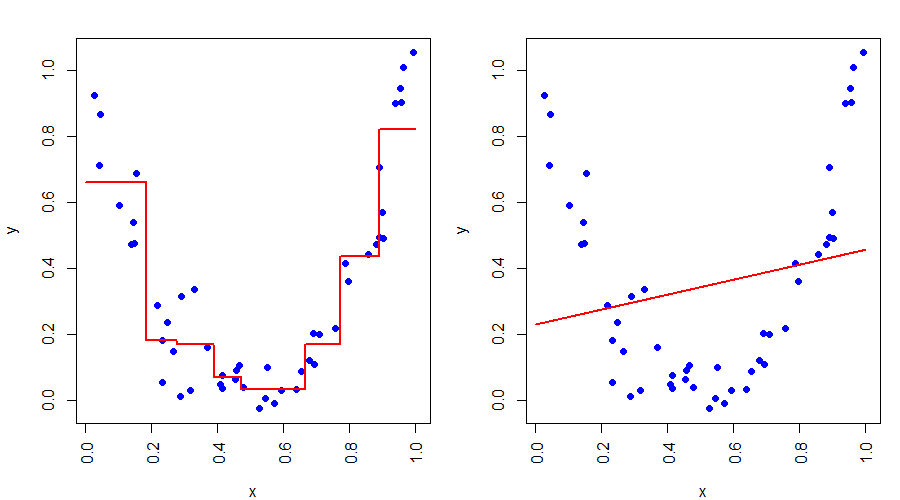

# Inhaltsverzeichnis

<style>
/* Globaler Text-Style */
.reveal section p,
.reveal section ul li {
  color: #ffffff !important;
  font-size: 0.9em;
}

.reveal h2 {
  color: #00d1b2 !important;
  font-size: 1.6em !important;
  text-transform: none !important;
  margin-bottom: 0.8em !important;
}

/* Styling für die Code-Blöcke */
.reveal .sourceCode {
  background-color: #282a36 !important;
  border-radius: 12px !important;
  border: 1px solid #44475a !important;
  overflow: hidden !important;
}

.reveal pre.sourceCode code {
  font-size: 0.75em !important;
  line-height: 1.4 !important;
  white-space: pre-wrap !important;
}
</style>

- Was ist ein Entscheidungsbaum?
- Arten von Entscheidungsbäumen
- Aufbau eines Entscheidungsbaumes
- Die Logik: Warum entsteht eine Treppe?
- Wie lernt der Algorithmus? 
- Einsatzgebiete 
- Vorteile
- Live-Coding Demo

# Was ist ein Entscheidungsbaum?

- **Grafisches Modell:** Darstellung von Entscheidungsprozessen
- **Ziel:** Vorhersage eines Wertes basierend auf einer Reihe von "Wenn-Dann"-Regeln
- **Struktur:** Eine Hierarchie von Fragen, die zu einem Endergebnis führen

# Arten von Entscheidungsbäumen

- **Klassifikationsbäume:** Kategorische Zielvariable (z.B. "Ist das Bild ein Hund oder eine Katze?")
- **Regressionsbäume:** Kontinuierliche Zielvariable (z.B. Preis, Temperatur, Risiko-Score)
- **Zeitreihen-Bäume:** Vorhersage von zeitabhängigen Daten

# Aufbau eines Entscheidungsbaumes

- **Wurzelknoten:** Der Startpunkt (die erste große Frage)
- **Entscheidungsknoten:** Weitere Verzweigungen basierend auf Bedingungen
- **Blattknoten:** Endpunkte; hier wird der **finale Vorhersagewert** ausgegeben


# Beispiel eines Entscheidungsbaums

{width="50%" fig-align="center"}


# Die Logik: Warum entsteht eine Treppe?

- **Partitionierung:** Der Baum teilt die Daten in rechteckige Regionen auf
- **Mittelwertbildung:** In jeder Region berechnet der Baum den **Durchschnittswert** aller dort liegenden Trainingsdaten
- **Konstanz:** Innerhalb einer Region gibt der Baum immer denselben Wert aus (flache Linie)
- **Sprung:** An der Grenze zur nächsten Region springt der Wert abrupt an $\rightarrow$ **Treppeneffekt**


# Beispiel für eine Treppe

{width="50%" fig-align="center"}


# Wie lernt der Algorithmus?

- **Split-Suche:** Er prüft für jedes Merkmal, welcher Schwellenwert den Fehler (Varianz) am stärksten senkt
- **Daten-Teilung:** Er spaltet die Daten in zwei Gruppen
- **Rekursion:** Dieser Prozess wiederholt sich für jede Gruppe, bis ein Stopp-Kriterium erreicht ist (z.B. max_depth)
- **Mittelwert:** In den "Blättern" wird der finale Durchschnitt gespeichert

# Einsatzgebiete (Versicherung)

- **Risikobewertung:** Vorhersage der Schadenshöhe in Euro
- **Beispiel-Regel:** - WENN Alter < 25 UND PS > 150 $\rightarrow$ Hohes Risiko (Stufe nach oben)
- **Vorteil:** Hohe **Transparenz** für Regulierungsbehörden – jede Entscheidung ist nachvollziehbar

# Vorteile auf einen Blick

- **Nachvollziehbarkeit:** "White-Box"-Modell (keine Black-Box)
- **Einfachheit:** Leicht zu visualisieren und zu verstehen
- **Flexibilität:** Kann nicht-lineare Zusammenhänge ohne Vorwissen erkennen
- **Robustheit:** Wenig Vorbereitung der Daten (Scaling) nötig

# Code Beispiel: Die Treppe visualisieren

## Vorbereitung & Daten
```{python}
#| echo: true
import numpy as np
import matplotlib.pyplot as plt
from sklearn.tree import DecisionTreeRegressor

# X = Kosten (in 1000 €), y = Gewinn (in 1000 €)
kosten = np.array([100, 500, 1500, 3500, 5000, 6000, 8000, 9500, 12000, 14000]).reshape(-1, 1)
gewinn = np.array([1000, 3000, 5000, 8000, 6500, 7000, 15000, 20000, 21000, 25000])
```

## Den Bauen trainieren
```{python}
#| echo: true
# Baum erstellen (max_depth=2 bedeutet: nur 2 Fragen erlaubt)
baum = DecisionTreeRegressor(max_depth=2)

# Baum lernt aus den Daten
baum.fit(kosten, gewinn)
```

## Vorhersage für neue Kosten
Der Baum hat jetzt intern Kisten gebildet(baum.fit(kosten, gewinn)).

Zum Beispiel:

Kiste A: Alle Spiele, die weniger als 4000 € gekostet haben

Kiste B: Alle Spiele zwischen 4000 € und 9000 €

Kiste C: Alle Spiele über 9000 €

## Den Baum grafisch darstellen
```bash

# Wir testen alle Kosten-Werte von 0 bis 15.000
test_kosten = np.arange(0, 15000, 1).reshape(-1, 1)
vorhersage = baum.predict(test_kosten)
plt.scatter(kosten, gewinn, color="red", label="Echte Spiele") # Die Punkte
plt.plot(test_kosten, vorhersage, color="blue", label="Baum-Vorhersage") # Die Treppe
plt.xlabel("Produktionskosten")
plt.ylabel("Gewinn")
plt.legend()
plt.show()
```

# Ergebnis: Die Treppe
```{python}
test_kosten = np.arange(0, 15000, 1).reshape(-1, 1)
vorhersage = baum.predict(test_kosten)
plt.scatter(kosten, gewinn, color="red", label="Echte Spiele") # Die Punkte
plt.plot(test_kosten, vorhersage, color="blue", label="Baum-Vorhersage") # Die Treppe
plt.xlabel("Produktionskosten")
plt.ylabel("Gewinn")
plt.legend()
plt.show()
```

# Danke für eure Aufmerksamkeit! 